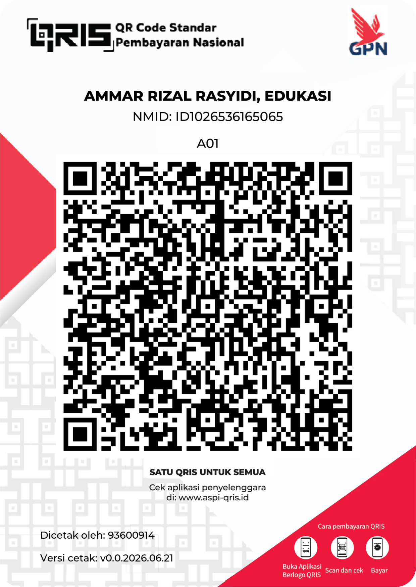

# Mandum Rimba

<p align="center">
  
</p>

<p align="center">
  <a href="https://trakteer.id/mabxx6yj8dnsbic9odnj/tip"></a>
  &nbsp;
  <a href="https://paypal.me/rrasyidi"></a>
</p>

<p align="center"><sub>If you chip in through Trakteer or PayPal, thank you. You're keeping this little project alive, and your name goes on the Rakan Rimba list if you'd like.</sub></p>

<details align="center">
  <summary><sub>Prefer to scan directly? QRIS &amp; GoPay</sub></summary>
  <br>
  
  &nbsp;&nbsp;
  
</details>

**An independent, non-profit observatory for Indonesia's forests, land, and
protected wildlife.** A map-first public-interest web app that distills credible
satellite and public data, deforestation, palm oil & mining expansion, linked
disasters, and the wildlife losing its home, into one open map anyone can check.

🌳 Live at **[mandumrimba.org](https://mandumrimba.org)** · bilingual (Indonesia / English)

📄 **White paper**, what Mandum Rimba is and why it exists:
[English](white_paper_mandum_rimba/Mandum-Rimba-White-Paper-EN.pdf) ·
[Bahasa Indonesia](white_paper_mandum_rimba/Mandum-Rimba-White-Paper-ID.pdf)

> **Evidence over accusation.** We gather and show the data as it is, and never
> draw conclusions on anyone's behalf. We overlay official data against
> satellite reality and let the gap speak. Every layer has a source, a date,
> and a methodology link.

## What's on the map

Live layers are checked; the rest are on the roadmap.

- [ ] **Deforestation alerts**, near-real-time forest-clearing points from
  satellite radar and optical sensors (10–30 m). *(planned)*
- [ ] **Annual tree-cover loss**, per-year loss aggregated by region, behind the
  region-page charts. *(planned)*
- [x] **Concessions**, oil palm, pulpwood, and logging concession boundaries.
- [ ] **Mining footprint**, satellite-mapped mined land for all minerals,
  peer-reviewed (physical footprint, not permit boundaries). *(planned)*
- [x] **Protected areas & forest moratorium**, national parks, nature reserves,
  wildlife sanctuaries, and moratorium polygons.
- [x] **Wildlife distribution**, threatened & endemic species across all classes,
  drawn from occurrence records and weighted by natural-habitat cover, then
  contoured per island so species stay where they actually live, each area
  tagged with the species recorded there and its IUCN status. Cryptic species
  whose coordinates are withheld for protection (e.g. Sumatran rhino) appear as
  clearly-flagged documented-range markers. Spans Sundaland, Wallacea (anoa,
  maleo, Komodo), Papua (tree-kangaroo, echidna), and the sea & rivers (turtles,
  dugong, Irrawaddy dolphin).
- [ ] **Disasters**, event-level floods and landslides. *(planned)*

### Shareable cards (browser-only)

Two tools turn a distant statistic into a neighbour: **"Yang Tinggal di
Dekatmu"** finds the nearest recorded threatened animal to your city (plus the
nearest protected area) and renders a share card, and **"Kartu Penduduk Rimba"**
issues a playful KTP-style resident card featuring that animal. **Photos and
location stay in the browser and are never uploaded or stored.**

## Data & sources

Every dataset is public and independently verifiable; the in-app
[methodology](https://mandumrimba.org/metodologi) and
[data-sources](https://mandumrimba.org/sumber-data) pages carry per-dataset
licenses, coverage, and update dates, plus an honest list of the gaps where
credible open data does not yet exist.

- **Global Forest Watch** (UMD / Wageningen), deforestation alerts, annual
  tree-cover loss, concession layers, CC BY 4.0
- **Maus et al. 2022**, global mining land use, CC BY 4.0
- **Protected Planet (WDPA)** + **KLHK PIPPIB**, protected areas & moratorium
- **GBIF** occurrences + **IUCN Red List** status + **Permen LHK P.106/2018**,
  **KKP** marine rules & **CITES**, protected-species selection
- **ESA WorldCover 2021**, natural-habitat cover (forest/savanna/wetland) used to
  weight the wildlife-distribution layer, CC BY 4.0
- **BNPB DIBI** (via UNDRR DesInventar), disaster events
- **Trase**, palm exporter ↔ deforestation linkage
- **GADM**, administrative boundaries · **HydroBASINS**, watersheds
- **Natural Earth**, urban-area reference used to drop city points (public domain)
- **OpenStreetMap / Nominatim**, location search (© OpenStreetMap contributors, ODbL)

The wildlife-distribution layer is an offline build: GBIF occurrence density for
threatened + flagship/endemic species, weighted by ESA WorldCover natural-habitat
cover (city points dropped) and contoured **per island** so a species never bleeds
onto an island it doesn't live on. Cryptic species with no public coordinates are
shown as documented-range markers. Pre-1990 museum specimens are excluded so the
map reflects present-day presence. The full build is in
[`scripts/species-distribution`](./scripts/species-distribution).

## How it's built

A [pnpm](https://pnpm.io) + [Turborepo](https://turbo.build) monorepo:

- **`apps/web`**, Next.js 14 (App Router), MapLibre GL with vector tiles,
  `next-intl` (Indonesian / English), Recharts.
- **`apps/api`**, NestJS: weekly ingest jobs that pull from the public sources
  above, build vector tiles, and expose a public read-only REST API.
- **`packages/shared`**, shared TypeScript domain types.

📖 **[DATA-FLOW.md](./DATA-FLOW.md)** explains how data moves from source to map ·
**[SETUP.md](./SETUP.md)** covers local setup, ingest jobs, and deployment.

## Local development

```bash
pnpm install

# each app ships an .env.example, copy and fill in source API keys + service
# connection strings (a database and an object store), then:
cp apps/api/.env.example apps/api/.env
cp apps/web/.env.example apps/web/.env.local

pnpm dev          # web on :3000, api on :4000
```

The ingest jobs run on a weekly schedule; data sources without a stable machine
endpoint are skipped cleanly when unconfigured, so the app runs with whatever
subset you have keys for.

## Editorial principles (non-negotiable)

1. **Evidence over accusation**, show the data as it is; never draw conclusions
   or make claims on the user's behalf.
2. **Every claim is clickable**, at most two clicks to the source dataset.
3. **Reproducible**, open pipeline, public methodology and changelog.
4. **Never fabricate**, data we cannot obtain is marked unavailable and the real
   provider is named; we never invent coordinates, ranges, or figures.
5. **Bilingual**, Indonesian first, English second.

## License & brand

The code is open; the brand is the maintainer's. The two are licensed separately.

- **Code**, [GNU AGPL-3.0-or-later](./LICENSE). Run, study, and improve it; if you
  deploy a modified version as a network service, you must offer your source.
- **Name & logos**, "Mandum Rimba", "Lam Rimba", and the project logos are
  **trademarks**, not covered by the code license. Forks must rebrand, see
  [TRADEMARK.md](./TRADEMARK.md).
- **Attribution**, a public derivative must credit *"Based on Mandum Rimba,
  https://mandumrimba.org"* (see [NOTICE](./NOTICE)).
- **Data**, belongs to each source under its own license; see the in-app
  [Data Sources](https://mandumrimba.org/sumber-data) and Credits pages.

Governance is a single-steward model ([GOVERNANCE.md](./GOVERNANCE.md)) and
contributions are under the [Contributor License Agreement](./CLA.md).
